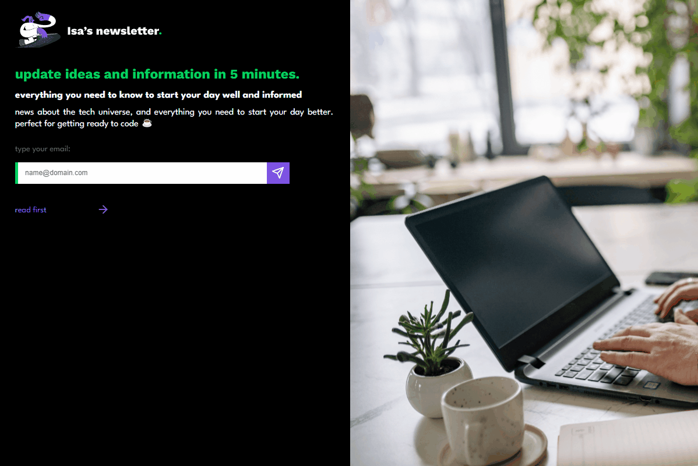

# Isa's newsletter

## About

A newsletter page integrated with a simple node back-end for saving emails in a database.

## Run

For back-end run `npm install` then `npm run dev`. For front-end install [Live Server extension](https://marketplace.visualstudio.com/items?itemName=ritwickdey.LiveServer), right click on `index.html` file and then click on `Open with Live Server`.

## Status

Done ✅

## License

[MIT](./LICENSE)
